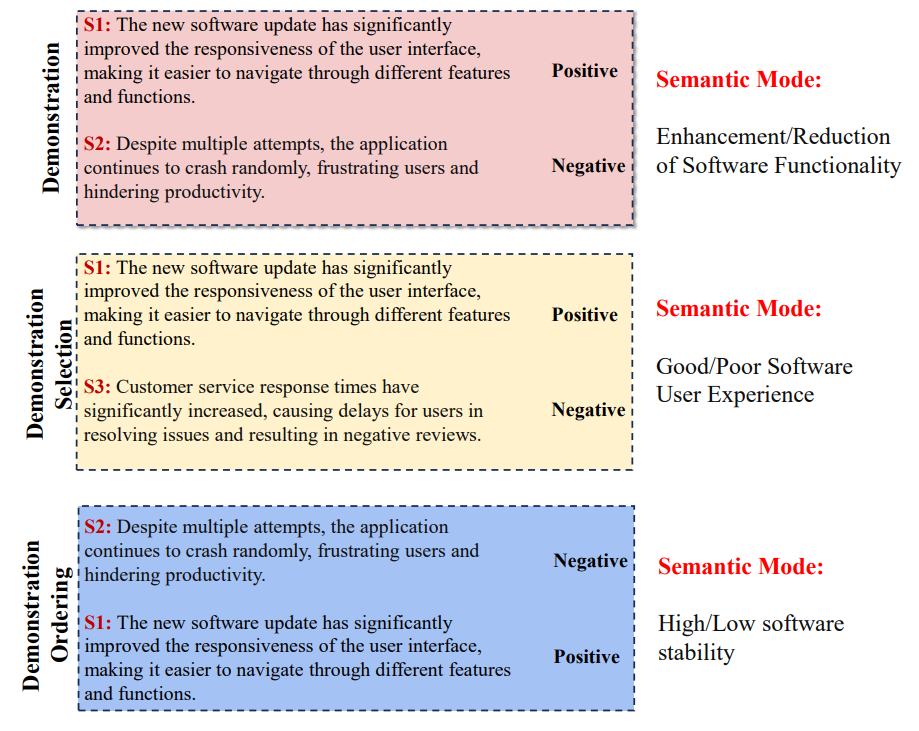

# Debiasing In-Context Learning by Instructing LLMs How to Follow Demonstrations
This repo contains the code in our paper [Debiasing In-Context Learning by Instructing LLMs How to Follow Demonstrations](https://aclanthology.org/2024.findings-acl.430/).

We explore the demonstration bias(the performance and robustness are severely affected by the selection and ordering of demonstrations) issue in In-Context Learning in this paper. 

We identify that such demonstration bias may primarily stem from the semantic ambiguity induced by demonstrations, i.e., a demonstration may indicate multiple input-to-label mappings and its mapping can be interpreted differently in different contexts by LLMs. Such semantic ambiguity disrupts task comprehension during ICL and results in performance fluctuations. 

    

To resolve the semantic ambiguity problem, this paper further proposes two de-biasing strategies to mitigate demonstration bias in in-context learning. Experiments on six datasets show that our methods can effectively alleviate demonstration bias and significantly improve task performance.